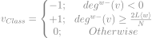

`network-science` `graph-theory` `heuristics` `network-analysis` `sis-model` `voter-model` `btc-alpha` `behavior-spread` `bilingual-model`

Study and analyze the BTC-Alpha network to identify influence of trust behavior dynamics on bitcoin-based cryptocurrency. Also, analyze how the roles of important individuals with the network contribute to the dynamics of cryptocurrency networks, particularly with regard to the privacy and network security. 

**A. Dataset Information**
- This is who-trusts-whom network of people who trade using Bitcoin on a platform called [Bitcoin OTC](http://www.bitcoin-otc.com/). Since Bitcoin users are anonymous, there is a need to maintain a record of users' reputation to prevent transactions with fraudulent and risky users. Members of Bitcoin OTC rate other members in a scale of -10 (total distrust) to +10 (total trust) in steps of 1. This is the first explicit weighted signed directed network available for research.

- _Dataset Statistics:_

| Properties | Information |
| :---- | :----: |
| Nodes |	5,881 |
| Edges|	35,592 |
| Range of edge weight |	-10 to +10 |
| Percentage of positive edges |	89% |

<br>
- _Source (Citation):_ The following BibTeX citation can be used:<br><br>

```
@inproceedings{kumar2016edge,
  title={Edge weight prediction in weighted signed networks},
  author={Kumar, Srijan and Spezzano, Francesca and Subrahmanian, VS and Faloutsos, Christos},
  booktitle={Data Mining (ICDM), 2016 IEEE 16th International Conference on},
  pages={221--230},
  year={2016},
  organization={IEEE}
}
```

```
@inproceedings{kumar2018rev2,
  title={Rev2: Fraudulent user prediction in rating platforms},
  author={Kumar, Srijan and Hooi, Bryan and Makhija, Disha and Kumar, Mohit and Faloutsos, Christos and Subrahmanian, VS},
  booktitle={Proceedings of the Eleventh ACM International Conference on Web Search and Data Mining},
  pages={333--341},
  year={2018},
  organization={ACM}
}
```

- _Files:_

| File	| Description |
| :--- | :--- |
| [soc-sign-bitcoinotc.csv.gz](https://snap.stanford.edu/data/soc-sign-bitcoinotc.csv.gz)	| Weighted Signed Directed Bitcoin OTC web of trust network |

<br>
- _Data Format:_ Each line has one rating, sorted by time, with the following format:<br><br>
```SOURCE, TARGET, RATING, TIME```<br>
where
  - `SOURCE`: node id of source, i.e., rater
  - `TARGET`: node id of target, i.e., ratee
  - `RATING`: the source's rating for the target, ranging from -10 to +10 in steps of 1
  - `TIME`: the time of the rating, measured as seconds since Epoch.

**B. Dataset Acquisition**
- To acquire the _[Bitcoin Alpha Trust Weighted Signed Network](https://snap.stanford.edu/data/soc-sign-bitcoinotc.csv.gz)_ in its present form we need to the following minor edition:
+ _Class:_ The class of each trader (node).
    - _Trusty Class_ (𝒯): `+1`
    - _Normal Class_ (𝒩): `0`
    - _Suspecious Class_ (𝒮): `-1`

+ The class label of the node `v` is calculated as following -<br><br>
<br>where
  - $deg^{w^-}(v)$ : Weighted in-degree of node `v`.
  - $L$ : Number of edges in network.
  - $N$ : Number of nodes in network.
  - $\left < w \right >$ : Average weight of the network.

**C. Network Visualization**


+ Orange nodes represent trusty (𝒯) class.
  - 𝟑𝟔.𝟒𝟖 % of the network
+ Sky-blue nodes represent normal (𝒩) class.
  - 𝟓𝟒.𝟗𝟔 % of the network
+ Black nodes represent suspicious (𝒮) class.
  - 𝟖.𝟓𝟔 % of the network
+ Edges acquired the source nodes color.

